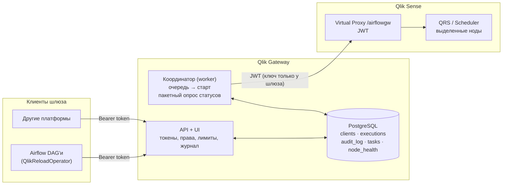

# Qlik Gateway

Буферный сервис между внешними планировщиками (Airflow, в дальнейшем другие платформенные команды) и Qlik Sense Enterprise on Windows.

Qlik видит **одного** пользователя: сервисную учётку шлюза, которая заходит через отдельный Virtual Proxy с JWT. Все остальные обращаются только к шлюзу. Шлюз проверяет права, ставит запуски в очередь, сам запускает reload, сам опрашивает Qlik, хранит историю и пишет в журнал каждое действие.

## Какие проблемы это решает

| Проблема (из переписки / письма вендора) | Как решено |
|---|---|
| У Airflow права админа, системные учётки с клиентским сертификатом, отозвать нельзя | Airflow не получает никаких доступов к Qlik. У него есть только токен шлюза. **Блокировка клиента в UI действует мгновенно** и не зависит от сертификатов на стороне Airflow. Доступ в Qlik — через Virtual Proxy + JWT (рекомендация вендора), ключ подписи есть только у шлюза |
| Нужно знать, кто, где, что и когда запускает | Каждый вызов попадает в журнал: клиент, IP, User-Agent, `dag_id`/`task_id`/`run_id`/try/owner/host (провайдер Airflow передаёт их сам), действие, результат, задержка. Журнал фильтруется в UI |
| Частый опрос статуса (`executionsession`/`task state`) нагружает Qlik | Клиенты получают статус **из БД шлюза**, в Qlik при этом запрос не уходит. Координатор опрашивает Qlik **одним пакетным запросом** по всем активным запускам раз в N секунд (`QGW_POLL_INTERVAL_SECONDS`), сколько бы DAG'ов ни ждали. Для Airflow есть long-poll `?wait=60` |
| Запуски должны идти через один координатор, а не из каждого бизнес-DAG | Координатор — это `qlik-gateway worker`, единственный компонент, который стартует reload и ходит за статусами. Бизнес-DAG только ставит заявку и ждёт |
| Нужен источник для массовой обработки состояний и хранения истории | Таблица `executions` хранит полную историю: очередь → старт → нода → статусы → сообщения Qlik → длительность. Там же каталог задач и снимки ресурсов нод |
| Быстро найти источник нагрузки и отключить его | Дашборд «Кто создаёт нагрузку»: вызовы, отклонённые запросы, запуски, дубли и ошибки по каждому клиенту. Отключить можно на трёх уровнях: заблокировать клиента (с отменой его очереди и, по желанию, остановкой reload), заблокировать задачу для всех или включить **стоп-кран** на всю отправку в Qlik |
| Ограничивать | На каждого клиента: разрешённые действия (`start/state/details/info/log/stop`), разрешённые задачи, разрешённые IP/подсети, лимит запросов в минуту, запусков в час, одновременных reload, приоритет, срок жизни токена. Для задачи — минимальный интервал между запусками. Глобально — предел одновременных reload |
| Балансировка на выделенные ноды (3 шедулера) | Custom property `ExternalRun=Yes` на приложениях плюс правило балансировки. Настройка описана в [docs/qlik-setup.md](docs/qlik-setup.md). Шлюз берёт в каталог только задачи с этим свойством |
| Кто какие задачи может запускать | Custom property `GatewayClient=<имя клиента>` на приложении в QMC: задачи становятся доступны этому клиенту автоматически. Дополнительно задачи можно выдать вручную в UI шлюза |
| Мониторинг: какой таск, состояние, потребляемые ресурсы | UI: активные запуски, топ задач по числу, ошибкам и времени, ноды Qlik (CPU, RAM, загруженные приложения по engine healthcheck), число запросов шлюза в Qlik за час. `/metrics` для Prometheus |
| Отдельных журналов вызовов API в Qlik нет | Шлюз сам журналирует каждый свой вызов в QRS: метод, endpoint, код ответа, задержку, ошибку |
| Двойные запуски одной задачи | Если задача уже в очереди или выполняется, новый запрос присоединяется к существующему запуску (`deduplicated: true`) |

## Архитектура



* **API** (`qlik-gateway api`) — REST для клиентов плюс админский UI. Сам в Qlik почти не ходит, только за логом скрипта и stop.
* **Координатор** (`qlik-gateway worker`) — раз в `QGW_DISPATCH_INTERVAL_SECONDS` берёт заявки из очереди с учётом приоритета, глобального и клиентского лимита параллельности, паузы и блокировок и стартует их в Qlik (`POST /qrs/task/{id}/start/synchronous`). Раз в `QGW_POLL_INTERVAL_SECONDS` одним запросом `GET /qrs/executionresult/full?filter=executionID eq … or …` обновляет все активные запуски. Периодически синхронизирует каталог задач и снимает health нод. Если поднять несколько реплик, активной будет одна, остальные ждут в резерве (lease в БД).

### Статусы запуска

`QUEUED` → `STARTING` → `RUNNING` → `SUCCESS` | `FAILED` | `ABORTED` | `SKIPPED`

Служебные статусы шлюза:
* `CANCELLED` — отменён до отправки в Qlik;
* `START_ERROR` — Qlik отказал в старте;
* `LOST` — Qlik так и не прислал результат;
* `TIMEOUT` — превышен лимит ожидания шлюза.

## Быстрый старт (демо с эмулятором Qlik)

```bash
python -m venv .venv && . .venv/bin/activate
pip install -e ".[dev]"
cp .env.example .env            # QGW_QLIK_MODE=mock
QGW_EMBEDDED_WORKER=true qlik-gateway api --workers 1
# UI:  http://localhost:8080/ui/   (admin / change-me из .env)
# API: http://localhost:8080/docs
```

Дальше в UI: «Задачи Qlik» → «Синхронизировать», затем «Клиенты» → «Новый клиент». Токен показывается один раз.

```bash
TOKEN=qgw_...
curl -s -X POST -H "Authorization: Bearer $TOKEN" -H "X-Airflow-Dag-Id: demo" \
     localhost:8080/api/v1/tasks/11111111-1111-1111-1111-111111111111/start
curl -s -H "Authorization: Bearer $TOKEN" "localhost:8080/api/v1/executions/1?wait=30"
```

Продакшен: `docker compose up` (Postgres, API и worker) или две службы на Windows/Linux-хосте с общим Postgres. Настройка стороны Qlik — [docs/qlik-setup.md](docs/qlik-setup.md).

## API для клиентов

Авторизация: `Authorization: Bearer <token>` (или `X-Api-Key`). Метаданные инициатора передаются заголовками `X-Airflow-*` / `X-Initiator-*` или полем `meta` в теле запроса на старт.

| Метод | Путь | Право | Что делает |
|---|---|---|---|
| GET | `/api/v1/whoami` | — | кто я, мои права и лимиты |
| GET | `/api/v1/tasks` | info | доступные мне задачи |
| GET | `/api/v1/tasks/{task_id}` | info | **getinfo**: задача и последние запуски |
| POST | `/api/v1/tasks/{task_id}/start` | start | **post task**: поставить reload, ответ `202 {execution_id, url, deduplicated, on_active, policy_source, warnings, running_execution}`. Тело: `{"on_active": "reject" \| "queue" \| "reuse"}` — что делать, если задача уже перезагружается, см. «Если задача уже запущена» ниже |
| GET | `/api/v1/executions/{id}?wait=N` | state | **get state** из БД шлюза, long-poll до 60 с |
| GET | `/api/v1/executions/{id}/details` | details | **getdetails**: нода, время, сообщения Qlik, инициатор |
| GET | `/api/v1/executions/{id}/log` | log | лог скрипта Qlik |
| POST | `/api/v1/executions/{id}/cancel` | stop | убрать из очереди или остановить reload |
| GET | `/api/v1/executions` | state | мои последние запуски |

Коды ошибок:
* `401` — нет токена или токен неверный;
* `403` — клиент заблокирован, нет права или задачи, чужой IP;
* `404` — задачи нет в каталоге;
* `409` — задача выключена в Qlik;
* `423` — задача заблокирована админом;
* `429` — превышен лимит.

Тело ответа при ошибке: `{"error": "<code>", "message": "..."}`.

## Airflow

Провайдер лежит в `airflow/plugins/qlik_gateway_provider`. Скопируйте его вместе с `airflow/plugins/.airflowignore` в `plugins/` Airflow (файл убирает ложные ошибки `Failed to import plugin`) и создайте Connection `qlik_gateway_default`: тип HTTP, host `https://qlik-gateway…`, в password — токен клиента.

```python
from qlik_gateway_provider import QlikReloadOperator, QlikExecutionSensor

QlikReloadOperator(
    task_id="reload_sales",
    qlik_task_id="<guid задачи>",
    deferrable=True,  # ждёт в triggerer, не держит слот воркера
)
```

* Оператор сам отправляет `dag_id`, `task_id`, `run_id`, `try_number`, `owner` и host, всё это видно в журнале и карточке запуска.
* При неуспехе хвост лога скрипта Qlik попадает в лог задачи Airflow.
* `on_active=None` (решает шлюз, по умолчанию `"reject"`) / `"queue"` / `"reuse"` — поведение, если задача Qlik уже перезагружается (см. «Если задача уже запущена» ниже). Применённое значение, предупреждения, активный запуск (номер, статус, время, свой/чужой клиент, для своего — dag/run, ссылка) пишутся в лог и в XCom `on_active`, `warnings`, `running_execution`, `execution_url`.
* `on_reject="fail"` (по умолчанию) / `"skip"` — если шлюз отказал (reject): упасть, чтобы Airflow перезапустил задачу позже по `retries` / `retry_delay`, или пометить skipped.
* `push_log="errors"` (по умолчанию) / `"full"` / `False` — при ошибке reload в лог Airflow попадает только ошибка скрипта (строки после «Произошла следующая ошибка») и ссылка на страницу запуска в шлюзе; `"full"` — ещё и хвост лога скрипта.
* Старые параметры `if_running` / `on_already_running` / `dedupe` работают как синонимы (attach=reuse, fresh/queue=queue, skip=reject).

### Если задача уже запущена (on_active)

1. **Задача не перезагружается**, запуск ждёт в очереди шлюза: все запросы на эту задачу, от любых клиентов,
   схлопываются в него — всем возвращается один `execution_id`. Он стартует позже и прочитает данные на момент старта.
2. **Задача перезагружается в Qlik** (кем бы и откуда ни была запущена через шлюз) — решает `on_active`:

| on_active | что происходит |
|---|---|
| **reject** (по умолчанию) | `409 already_running` + причина + активный запуск (кто/когда, `url` на страницу в шлюзе). Клиент сам решает: ждать, повторить позже, перезапустить с `queue` |
| queue | запрос ставится в очередь шлюза; после завершения активного стартует один новый запуск, в который схлопываются все `queue`-запросы. `reject` и `reuse` в него не схлопываются: пока задача идёт в Qlik, reject получает 409 (в ответе есть и `queued_execution`), reuse — активный запуск |
| reuse | возвращается активный `execution_id` + информация/ссылка; предупреждение `reused_active_run`: он стартовал раньше запроса и может не содержать новых данных |

Администратор может **навязать** значение в UI: на задаче (Задачи → Edit) и на клиенте (Клиенты → клиент).
Приоритет: задача → клиент → параметр запроса → `QGW_DEFAULT_ON_ACTIVE` (по умолчанию `reject`).
Если значение клиента заменено — в ответе `policy_source` = `task`/`client` и предупреждение `policy_overridden`.
Новый запуск (queue) проверяет «минимальный интервал» задачи и лимит запусков в час; схлопывание и reuse — нет.
Запуск, в который схлопнулись другие запросы, клиент через API отменить не может (`409 shared_execution`),
а чужой — вообще (`403 not_owner`); администратор в UI — может.

Все запросы к запуску — кто его создал, кто присоединился, кому отказали и почему — видны в UI на странице
запуска, раздел «Запросы на этот запуск»; в списке «Запуски» рядом с клиентом — счётчик `+N` присоединившихся.
Демонстрация: DAG `qlik_gateway_on_active_demo` (две «команды» = два connection: `qlik_gateway_default`
и `qlik_gateway_team_b`) или скрипт `deploy/windows/test-on-active.ps1`.

Ссылки (`url`) строятся от адреса, по которому клиент обратился к шлюзу; задать явно — `QGW_PUBLIC_URL`.

## Конфигурация

Все параметры задаются переменными окружения `QGW_*`: см. [.env.example](.env.example) и `qlik_gateway/config.py`. Основные:

| Переменная | По умолчанию | |
|---|---|---|
| `QGW_DATABASE_URL` | sqlite | для продакшена `postgresql+psycopg://…` |
| `QGW_QLIK_MODE` | `mock` | `jwt` для реального Qlik |
| `QGW_QLIK_BASE_URL` | | `https://qlik-host/<prefix виртуального прокси>` |
| `QGW_QLIK_JWT_*` | | ключ, пользователь, директория, имена атрибутов |
| `QGW_QLIK_TASK_CUSTOM_PROPERTY(_VALUE)` | `ExternalRun`/`Yes` | периметр: какие задачи доступны через шлюз |
| `QGW_QLIK_CLIENT_CUSTOM_PROPERTY` | `GatewayClient` | свойство приложения со списком клиентов, которым оно доступно |
| `QGW_MAX_CONCURRENT_EXECUTIONS` | 3 | общий предел одновременных reload через шлюз |
| `QGW_POLL_INTERVAL_SECONDS` | 20 | как часто шлюз опрашивает Qlik (один запрос на всех) |
| `QGW_NODE_HEALTH_URLS` | | `https://node1/airflowgw/engine/healthcheck,…` |
| `QGW_LDAP_URL`, `QGW_LDAP_DOMAIN`, `QGW_LDAP_BASE_DN` | | вход в UI через AD, см. «Вход в UI и роли» |
| `QGW_LDAP_ADMIN_GROUPS` / `QGW_LDAP_VIEWER_GROUPS` | `QGW-Admins` / `QGW-Viewers` | AD-группы ролей |

### Вход в UI и роли

| Роль | Кто | Что видит и может |
|---|---|---|
| admin | AD-группа `QGW_LDAP_ADMIN_GROUPS` или локальная учётка | всё: клиенты и токены, задачи, стоп-кран, параметры, пользователи |
| viewer | AD-группа `QGW_LDAP_VIEWER_GROUPS` | всё только на просмотр |
| team | AD-группа, указанная на карточке клиента («AD-группы команды») | только своих клиентов: их запуски (и чужие запуски, к которым присоединились или которые отказали их запросам — без деталей другой команды), задачи, журнал; может отменить свой запуск, если к нему никто не присоединился |

Вход через AD включается `QGW_LDAP_URL`: пароль проверяется bind'ом от имени самого пользователя
(служебная учётка для AD не нужна), группы читаются с учётом вложенности, роль — при каждом входе.
Если пользователь в нескольких группах, берётся старшая роль (admin > viewer > team).
Локальная учётка (`QGW_BOOTSTRAP_ADMIN_*` или `manage.cmd create-admin`) — аварийная, работает без AD.
Отключить пользователя: Настройки → Пользователи UI → «Отключить» (выходит из UI при следующем действии).

## Эксплуатация

* **Отозвать доступ** у клиента: UI → Клиенты → «Заблокировать». Токен перестаёт работать сразу. При необходимости здесь же отменяется очередь клиента и останавливаются его reload.
* **Инцидент на кластере**: дашборд → «Стоп-кран». Заявки продолжают приниматься, но в Qlik ничего не уходит, пока паузу не снимут.
* **Найти источник нагрузки**: дашборд «Кто создаёт нагрузку», затем «Журнал» с фильтром по клиенту или `outcome=limited/denied`, затем «Запуски» с фильтром по инициатору (`dag_id`).
* **Метрики**: `/metrics` — `qgw_api_requests_total{client,action,outcome}`, `qgw_qlik_calls_total`, `qgw_qlik_call_seconds`, `qgw_executions_active`, `qgw_executions_finished_total`, `qgw_dispatch_paused`.
* **Журнал** хранится `QGW_AUDIT_RETENTION_DAYS` дней (по умолчанию 90).
* **CLI**: `qlik-gateway create-admin <user>`, `qlik-gateway create-client <name> --tasks '*'`.

## Разработка

```bash
pip install -e ".[dev]" requests ruff
pytest          # 30 тестов: API, координатор, UI, QRS-клиент (JWT/xrfkey/фильтры), провайдер Airflow против живого шлюза
ruff check .
```
